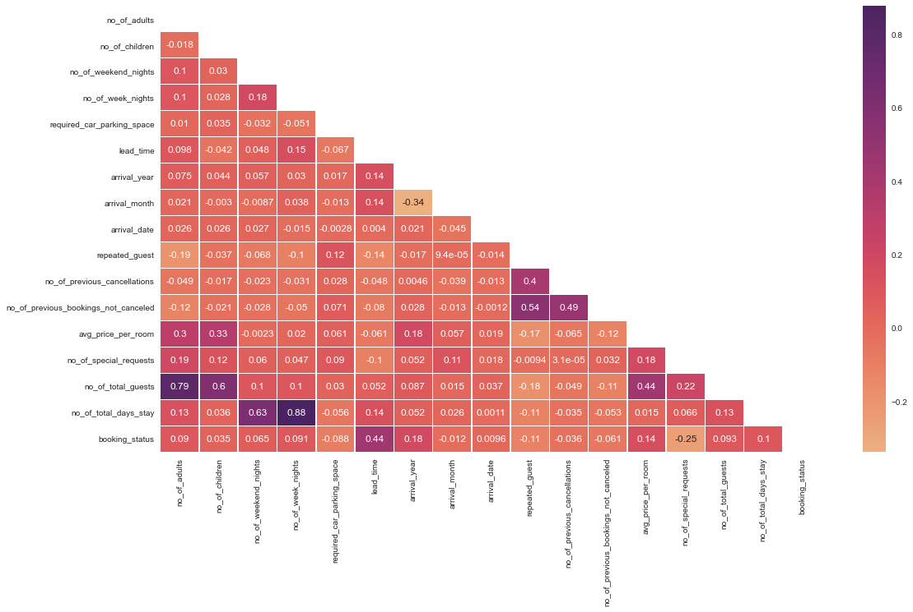
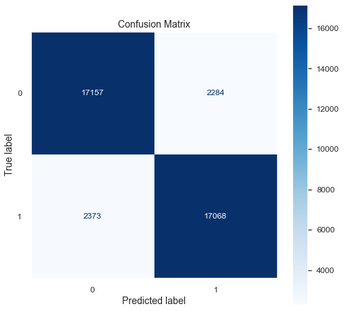
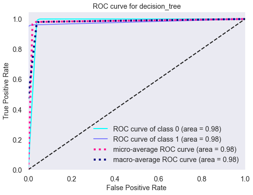

[](https://github.com/ellerbrock/open-source-badges/)

# Key findings: Most of the bookings are done by 2 adults in the months of Asugust, September and October, requesting no parking spot and choosing Room Type 1 and Meal Plan 1. Most of them also do not make any special requests or have any previous cancellations.

## Authors

- [@vashishtmarhwal](https://www.github.com/vashishtmarhwal)

## Table of Contents

  - [Business problem](#business-problem)
  - [Data source](#data-source)
  - [Methods](#methods)
  - [Tech Stack](#tech-stack)
  - [Quick glance at the results](#quick-glance-at-the-results)
  - [Lessons learned and recommendation](#lessons-learned-and-recommendation)
  - [Limitation and what can be improved](#limitation-and-what-can-be-improved)
  - [Run Locally](#run-locally)
  - [Explore the notebook](#explore-the-notebook)
  - [Repository structure](#repository-structure)
  - [Contribution](#contribution)


## Business problem

This projects aims to predict if the customer is likely to cancel their reservation at Hotel INN or not. This may help the Hotel better allocate their resources and/or offer discounts or special prices to their loyal customer base. 

## Data source

- [Hotel Reservations Dataset] (https://www.kaggle.com/datasets/ahsan81/hotel-reservations-classification-dataset)

## Methods

- Exploratory data analysis
- Bivariate analysis
- Multivariate correlation
- Model Selection

## Tech Stack

- Python (refer to requirement.txt for the packages used in this project)

## Quick glance at the results

Correlation between the features.



Confusion matrix of Decision Tree Model.



ROC curve of Decision Tree Model.



Top 3 models (with default parameters)

| Model     	                | Recall score 	|
|-------------------	        |------------------	|
| Decision Tree              	| 88% 	            |
| K-Nearest Neighbour  	        | 85% 	            |
| Gradient boosting        	    | 84% 	            |


- **The final model used for this project: Decision Trees**
- **Metrics used: Recall**

 **Lessons learned and recommendation**

- Based on this project's lead time, average price per room, market segment for bookinh, and number of special requests are the four most predictive features in determining whether a customer will cancel their booking ot not. Arrival Date and Month are slightly helpful as well. Car Parking space and Total guests are least helpful.
- The recommendation would be to focus more on the most predictive features when looking at the customer profile and pay less attention to the least predictive features.

## Limitation and what can be improved

- Hyperparameter tuning with grid search or random search.
- Better interpretation of the chi-square test

## Run Locally
Initialize git

```bash
git init
```


Clone the project

```bash
git clone https://github.com/vashishtmarhwal/hotel_reservation_cancellation_prediction.git
```

enter the project directory

```bash
cd hotel_reservation_cancellation_prediction
```

Create a conda virtual environment and install all the packages from the environment.yml (recommended)

```bash
conda env create --prefix <env_name> --file assets/environment.yml
```

Activate the conda environment

```bash
conda activate <env_name>
```

List all the packages installed

```bash
conda list
```

## Explore the notebook

To explore the notebook file [here](https://nbviewer.org/github/vashishtmarhwal/hotel_reservation_cancellation_prediction/blob/master/EDA.ipynb)

## Repository structure


```

├── assets
│   ├── confusion       .png                      <- confusion matrix image used in the README.
│   ├── heatmap.png                               <- heatmap image used in the README.
│   ├── roc.png                                   <- ROC image used in the README.
│
├── datasets
│   ├── Hotel Reservation.csv                     <- the dataset with customer information (with the target variable).
│   ├── Feature Description.txt                   <- the description of each feature in dataset
│   ├── test.csv                                  <- the test data (with target variable).
│   ├── train.csv                                 <- the train data (with target variable).
│
│
│
│
├── .gitignore                                    <- used to ignore certain folder and files that won't be commit to git.
│
│
├── EDA.ipynb         <- main python notebook where all the analysis and modeling are done.
│
│
│
├── README.md                                     <- this readme file.
│
│
├── requirements.txt                              <- list of all the dependencies with their versions(used for Streamlit).
